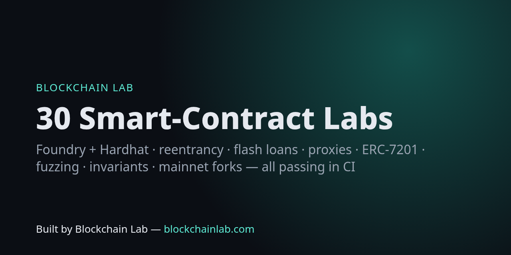

# Blockchain Lab — hands-on smart-contract labs



[](https://github.com/Blockchains/blockchainlab-labs/actions/workflows/ci.yml)

**54 runnable labs — 45 Solidity labs with Foundry tests, 4 Noir zero-knowledge labs and 4 Cairo/Starknet labs — from storage basics to reentrancy, flash loans, proxies, ERC-7201, fuzzing, invariants and mainnet forks** — plus a bonus Hardhat lab. Every lab compiles and passes in CI.

> Built by **Blockchain Lab — [blockchainlab.com](https://blockchainlab.com/?utm_source=github&utm_medium=readme&utm_campaign=blockchainlab-labs)**

## Run

```bash
git clone --recursive https://github.com/Blockchains/blockchainlab-labs && cd blockchainlab-labs
curl -L https://foundry.paradigm.xyz | bash && foundryup     # if you don't have Foundry
forge test                          # all 45 Solidity labs (131 tests)
forge test --match-path test/L09*   # one lab
forge test --match-path test/L29* -vv   # mainnet fork lab (uses https://ethereum-rpc.publicnode.com or MAINNET_RPC_URL)
cd hardhat && npm ci && npx hardhat test   # bonus Hardhat lab
```

## Labs

| # | Lab | You learn | Exercise | Blockchain Lab |
|---|---|---|---|---|
| 01 | [SimpleStorage](src/L01_SimpleStorage.sol) · [test](test/L01_SimpleStorage.t.sol) | State variables, storage slot 0, first fuzz test | Add a `uint256[] history` and push every value; assert its length. | [read](https://blockchainlab.com/learn/concepts/smart-contract?utm_source=github&utm_medium=readme&utm_campaign=blockchainlab-labs) · [tool](https://blockchains.github.io/blockchainlab-tools/storage/) |
| 02 | [Counter](src/L02_Counter.sol) · [test](test/L02_Counter.t.sol) | Events, custom errors, vm.expectEmit / expectRevert | Add `reset()` restricted to the deployer. | [read](https://blockchainlab.com/learn/concepts/smart-contract?utm_source=github&utm_medium=readme&utm_campaign=blockchainlab-labs) · [tool](https://blockchains.github.io/blockchainlab-tools/abi/) |
| 03 | [Ownable](src/L03_Ownable.sol) · [test](test/L03_Ownable.t.sol) | Access control, two-step ownership | Add a `renounceOwnership` with a 2-day delay. | [read](https://blockchainlab.com/development-lab/smart-contract-security-assurance?utm_source=github&utm_medium=readme&utm_campaign=blockchainlab-labs) |
| 04 | [ERC20Scratch](src/L04_ERC20Scratch.sol) · [test](test/L04_ERC20Scratch.t.sol) | ERC-20 from first principles, infinite allowance | Add `increaseAllowance` and a test for the approve front-running problem. | [read](https://blockchainlab.com/learn/concepts/tokenisation?utm_source=github&utm_medium=readme&utm_campaign=blockchainlab-labs) · [tool](https://blockchains.github.io/blockchainlab-tools/reference/?q=20) |
| 05 | [OZToken](src/L05_OZToken.sol) · [test](test/L05_OZToken.t.sol) | OpenZeppelin ERC20Capped + AccessControl roles | Add a PAUSER_ROLE using ERC20Pausable. | [read](https://blockchainlab.com/learn/concepts/tokenisation?utm_source=github&utm_medium=readme&utm_campaign=blockchainlab-labs) |
| 06 | [NFT](src/L06_NFT.sol) · [test](test/L06_NFT.t.sol) | ERC-721 paid mint, supply cap, tokenURI | Add a Merkle-gated presale (combine with lab 11). | [read](https://blockchainlab.com/learn/concepts/tokenisation?utm_source=github&utm_medium=readme&utm_campaign=blockchainlab-labs) · [tool](https://blockchains.github.io/blockchainlab-tools/reference/?q=721) |
| 07 | [MultiToken](src/L07_MultiToken.sol) · [test](test/L07_MultiToken.t.sol) | ERC-1155 fungible + non-fungible items, batch transfer | Add a crafting function that burns 100 GOLD to mint a SWORD. | [read](https://blockchainlab.com/learn/concepts/tokenisation?utm_source=github&utm_medium=readme&utm_campaign=blockchainlab-labs) |
| 08 | [EtherVault](src/L08_EtherVault.sol) · [test](test/L08_EtherVault.t.sol) | receive(), checks-effects-interactions, pull payments | Add a per-user daily withdrawal limit. | [read](https://blockchainlab.com/learn/concepts/custody?utm_source=github&utm_medium=readme&utm_campaign=blockchainlab-labs) |
| 09 | [Reentrancy](src/L09_Reentrancy.sol) · [test](test/L09_Reentrancy.t.sol) | Reentrancy exploit end-to-end and two fixes | Write a cross-function reentrancy variant and fix it. | [read](https://blockchainlab.com/learn/failure-atlas?utm_source=github&utm_medium=readme&utm_campaign=blockchainlab-labs) |
| 10 | [Arithmetic](src/L10_Arithmetic.sol) · [test](test/L10_Arithmetic.t.sol) | Checked vs unchecked maths, rounding direction | Find an input where rounding the wrong way lets a user extract value. | [read](https://blockchainlab.com/development-lab/smart-contract-security-assurance?utm_source=github&utm_medium=readme&utm_campaign=blockchainlab-labs) · [tool](https://blockchains.github.io/blockchainlab-tools/units/) |
| 11 | [MerkleAirdrop](src/L11_MerkleAirdrop.sol) · [test](test/L11_MerkleAirdrop.t.sol) | OpenZeppelin StandardMerkleTree allowlist claim | Build your own tree in the Tools hash page and claim with it. | [read](https://blockchainlab.com/learn/concepts/merkle-tree?utm_source=github&utm_medium=readme&utm_campaign=blockchainlab-labs) · [tool](https://blockchains.github.io/blockchainlab-tools/hash/) |
| 12 | [Permit](src/L12_Permit.sol) · [test](test/L12_Permit.t.sol) | EIP-2612 / EIP-712 typed signatures, replay & expiry | Implement a `depositWithPermit` vault. | [read](https://blockchainlab.com/learn/concepts/private-key?utm_source=github&utm_medium=readme&utm_campaign=blockchainlab-labs) · [tool](https://blockchains.github.io/blockchainlab-tools/reference/?q=2612) |
| 13 | [Signatures](src/L13_Signatures.sol) · [test](test/L13_Signatures.t.sol) | EIP-191 signed vouchers, ecrecover via ECDSA, nonces | Add an expiry and show signature malleability is handled by ECDSA. | [read](https://blockchainlab.com/learn/concepts/public-key?utm_source=github&utm_medium=readme&utm_campaign=blockchainlab-labs) |
| 14 | [MultiSig](src/L14_MultiSig.sol) · [test](test/L14_MultiSig.t.sol) | M-of-N wallet: submit / confirm / execute | Add revoke-confirmation and owner rotation via self-call. | [read](https://blockchainlab.com/intelligence/custody/mpc-vs-multisig-vs-hsm?utm_source=github&utm_medium=readme&utm_campaign=blockchainlab-labs) |
| 15 | [Timelock](src/L15_Timelock.sol) · [test](test/L15_Timelock.t.sol) | Queued governance actions with delay and grace | Add `cancel()` and emit events for off-chain monitoring. | [read](https://blockchainlab.com/learn/concepts/smart-contract?utm_source=github&utm_medium=readme&utm_campaign=blockchainlab-labs) |
| 16 | [CommitReveal](src/L16_CommitReveal.sol) · [test](test/L16_CommitReveal.t.sol) | Hiding choices to resist front-running | Add a deposit that is slashed if a committer never reveals. | [read](https://blockchainlab.com/learn/concepts/hash?utm_source=github&utm_medium=readme&utm_campaign=blockchainlab-labs) · [tool](https://blockchains.github.io/blockchainlab-tools/hash/) |
| 17 | [DutchAuction](src/L17_DutchAuction.sol) · [test](test/L17_DutchAuction.t.sol) | Linear price decay, refunds | Make the decay exponential and compare gas. | [read](https://blockchainlab.com/learn/concepts/smart-contract?utm_source=github&utm_medium=readme&utm_campaign=blockchainlab-labs) |
| 18 | [EnglishAuction](src/L18_EnglishAuction.sol) · [test](test/L18_EnglishAuction.t.sol) | Bidding with pull refunds (DoS-safe) | Add anti-sniping: extend the end time on late bids. | [read](https://blockchainlab.com/learn/concepts/smart-contract?utm_source=github&utm_medium=readme&utm_campaign=blockchainlab-labs) |
| 19 | [Crowdfund](src/L19_Crowdfund.sol) · [test](test/L19_Crowdfund.t.sol) | SafeERC20, goals, deadlines, refunds | Support fee-on-transfer tokens correctly. | [read](https://blockchainlab.com/learn/concepts/smart-contract?utm_source=github&utm_medium=readme&utm_campaign=blockchainlab-labs) |
| 20 | [StakingRewards](src/L20_StakingRewards.sol) · [test](test/L20_StakingRewards.t.sol) | Reward-per-token accumulator (Synthetix pattern) | Add a reward period end and `notifyRewardAmount`. | [read](https://blockchainlab.com/intelligence/staking/native-vs-liquid-vs-restaking?utm_source=github&utm_medium=readme&utm_campaign=blockchainlab-labs) |
| 21 | [ConstantProductAMM](src/L21_ConstantProductAMM.sol) · [test](test/L21_ConstantProductAMM.t.sol) | x·y=k swaps, 0.3% fee, LP shares, slippage | Add a TWAP price oracle accumulator. | [read](https://blockchainlab.com/learn/concepts/smart-contract?utm_source=github&utm_medium=readme&utm_campaign=blockchainlab-labs) |
| 22 | [FlashLoan](src/L22_FlashLoan.sol) · [test](test/L22_FlashLoan.t.sol) | ERC-3156 flash lender and borrower | Use a flash loan to arbitrage two lab-21 pools. | [read](https://blockchainlab.com/learn/failure-atlas?utm_source=github&utm_medium=readme&utm_campaign=blockchainlab-labs) · [tool](https://blockchains.github.io/blockchainlab-tools/reference/?q=3156) |
| 23 | [UpgradeableProxy](src/L23_UpgradeableProxy.sol) · [test](test/L23_UpgradeableProxy.t.sol) | UUPS + ERC-1967 proxy, initialisers, upgrade auth | Add a storage-collision bug in V2 and catch it with a test. | [read](https://blockchainlab.com/development-lab/smart-contract-security-assurance?utm_source=github&utm_medium=readme&utm_campaign=blockchainlab-labs) · [tool](https://blockchains.github.io/blockchainlab-tools/storage/) |
| 24 | [NamespacedStorage](src/L24_NamespacedStorage.sol) · [test](test/L24_NamespacedStorage.t.sol) | ERC-7201 namespaced storage layout | Add a second namespace and prove they never collide. | [read](https://blockchainlab.com/development-lab/smart-contract-security-assurance?utm_source=github&utm_medium=readme&utm_campaign=blockchainlab-labs) · [tool](https://blockchains.github.io/blockchainlab-tools/storage/) |
| 25 | [StorageLayout](src/L25_StorageLayout.sol) · [test](test/L25_StorageLayout.t.sol) | Packing, mappings, arrays, short strings via vm.load | Store a 40-byte string and decode the long-string layout. | [read](https://blockchainlab.com/learn/concepts/smart-contract?utm_source=github&utm_medium=readme&utm_campaign=blockchainlab-labs) · [tool](https://blockchains.github.io/blockchainlab-tools/storage/) |
| 26 | [GasOptimisation](src/L26_GasOptimisation.sol) · [test](test/L26_GasOptimisation.t.sol) | Packing, caching, calldata, unchecked loops | Run `forge snapshot` and cut another 10%. | [read](https://blockchainlab.com/learn/concepts/virtual-machine?utm_source=github&utm_medium=readme&utm_campaign=blockchainlab-labs) · [tool](https://blockchains.github.io/blockchainlab-tools/gas/) |
| 27 | [FuzzMath](src/L27_FuzzMath.sol) · [test](test/L27_FuzzMath.t.sol) | Property-based fuzzing finds a precision bug | Write a fuzz test that fails on `afterFeeBuggy`. | [read](https://blockchainlab.com/development-lab/smart-contract-security-assurance?utm_source=github&utm_medium=readme&utm_campaign=blockchainlab-labs) |
| 28 | [InvariantVault](src/L28_InvariantVault.sol) · [test](test/L28_InvariantVault.t.sol) | Stateful invariant testing with a handler + ghost vars | Introduce a bug in withdraw and watch the invariant catch it. | [read](https://blockchainlab.com/development-lab/smart-contract-security-assurance?utm_source=github&utm_medium=readme&utm_campaign=blockchainlab-labs) |
| 29 | [MainnetFork](test/L29_MainnetFork.t.sol) · [test](test/L29_MainnetFork.t.sol) | Fork tests against real USDC / WETH via public RPC | Fork Base and test real Base USDC. | [read](https://blockchainlab.com/learn/protocol-atlas?utm_source=github&utm_medium=readme&utm_campaign=blockchainlab-labs) · [tool](https://blockchains.github.io/blockchainlab-tools/address/?q=0xA0b86991c6218b36c1d19D4a2e9Eb0cE3606eB48) |
| 30 | [Create2Factory](src/L30_Create2Factory.sol) · [test](test/L30_Create2Factory.t.sol) | CREATE2 deterministic deployment and address prediction | Predict the address off-chain with ethers `getCreate2Address`. | [read](https://blockchainlab.com/learn/concepts/smart-contract?utm_source=github&utm_medium=readme&utm_campaign=blockchainlab-labs) · [tool](https://blockchains.github.io/blockchainlab-tools/hash/) |
| 31 | [ERC4626Vault](src/L31_ERC4626Vault.sol) · [test](test/L31_ERC4626Vault.t.sol) | ERC-4626 vaults and the first-depositor inflation attack vs virtual shares | Show the attack is still possible with offset 0 and a bigger donation, and compute its cost. | [read](https://blockchainlab.com/learn/concepts/tokenisation?utm_source=github&utm_medium=readme&utm_campaign=blockchainlab-labs) |
| 32 | [Governance](src/L32_Governance.sol) · [test](test/L32_Governance.t.sol) | OZ Governor + ERC20Votes + TimelockController full lifecycle | Add GovernorPreventLateQuorum and test a late whale vote. | [read](https://blockchainlab.com/learn/concepts/smart-contract?utm_source=github&utm_medium=readme&utm_campaign=blockchainlab-labs) |
| 33 | [Vesting](src/L33_Vesting.sol) · [test](test/L33_Vesting.t.sol) | VestingWalletCliff: cliff + linear release | Make a factory that deploys one vesting wallet per employee. | [read](https://blockchainlab.com/learn/concepts/tokenisation?utm_source=github&utm_medium=readme&utm_campaign=blockchainlab-labs) |
| 34 | [PaymentSplitter](src/L34_PaymentSplitter.sol) · [test](test/L34_PaymentSplitter.t.sol) | Pull-based revenue splits for ETH and ERC-20 | Add a shareholder via a 2-of-3 vote. | [read](https://blockchainlab.com/learn/concepts/smart-contract?utm_source=github&utm_medium=readme&utm_campaign=blockchainlab-labs) |
| 35 | [Royalties](src/L35_Royalties.sol) · [test](test/L35_Royalties.t.sol) | ERC-2981 default and per-token royalties | Add a marketplace that pays royalties on sale. | [read](https://blockchainlab.com/learn/concepts/tokenisation?utm_source=github&utm_medium=readme&utm_campaign=blockchainlab-labs) · [tool](https://blockchains.github.io/blockchainlab-tools/reference/?q=2981) |
| 36 | [Soulbound](src/L36_Soulbound.sol) · [test](test/L36_Soulbound.t.sol) | ERC-5192 non-transferable credentials | Add issuer revocation with an event. | [read](https://blockchainlab.com/learn/concepts/tokenisation?utm_source=github&utm_medium=readme&utm_campaign=blockchainlab-labs) |
| 37 | [OracleConsumer](src/L37_OracleConsumer.sol) · [test](test/L37_OracleConsumer.t.sol) | Chainlink AggregatorV3 consumer: staleness, decimals, bad answers | Add an L2 sequencer-uptime feed check. | [read](https://blockchainlab.com/learn/concepts/oracle?utm_source=github&utm_medium=readme&utm_campaign=blockchainlab-labs) · [tool](https://blockchains.github.io/blockchainlab-tools/verify/) |
| 38 | [TransientStorage](src/L38_TransientStorage.sol) · [test](test/L38_TransientStorage.t.sol) | EIP-1153 TSTORE/TLOAD reentrancy lock | Compare gas with an SSTORE-based guard using forge snapshot. | [read](https://blockchainlab.com/learn/concepts/virtual-machine?utm_source=github&utm_medium=readme&utm_campaign=blockchainlab-labs) · [tool](https://blockchains.github.io/blockchainlab-tools/gas/) |
| 39 | [SmartAccount](src/L39_SmartAccount.sol) · [test](test/L39_SmartAccount.t.sol) | Meta-transactions and ERC-1271 contract signatures | Add a session key with an expiry and a spend limit. | [read](https://blockchainlab.com/learn/concepts/smart-contract?utm_source=github&utm_medium=readme&utm_campaign=blockchainlab-labs) · [tool](https://blockchains.github.io/blockchainlab-tools/eip712/) |
| 40 | [MinimalProxy](src/L40_MinimalProxy.sol) · [test](test/L40_MinimalProxy.t.sol) | EIP-1167 clones, initializer locking, deterministic addresses | Measure deploy gas for clone vs full deploy in a script. | [read](https://blockchainlab.com/learn/concepts/smart-contract?utm_source=github&utm_medium=readme&utm_campaign=blockchainlab-labs) · [tool](https://blockchains.github.io/blockchainlab-tools/vanity/) |
| 41 | [Sandwich](test/L41_Sandwich.t.sol) · [test](test/L41_Sandwich.t.sol) | MEV sandwich on an AMM, and slippage limits as the defence | Find the largest victim trade 0.5% slippage still protects. | [read](https://blockchainlab.com/learn/failure-atlas?utm_source=github&utm_medium=readme&utm_campaign=blockchainlab-labs) · [tool](https://blockchains.github.io/blockchainlab-tools/mev/) |
| 42 | [SpotOracleLending](src/L42_SpotOracleLending.sol) · [test](test/L42_SpotOracleLending.t.sol) | Spot-price oracle manipulation leading to over-borrowing | Replace the spot price with a TWAP and re-run the attack. | [read](https://blockchainlab.com/learn/failure-atlas?utm_source=github&utm_medium=readme&utm_campaign=blockchainlab-labs) · [tool](https://blockchains.github.io/blockchainlab-tools/price-impact/) |
| 43 | [CrossChainReplay](src/L43_CrossChainReplay.sol) · [test](test/L43_CrossChainReplay.t.sol) | Signature replay across chains/contracts; EIP-712 domain binding | Add a deadline and test expiry. | [read](https://blockchainlab.com/learn/concepts/public-key?utm_source=github&utm_medium=readme&utm_campaign=blockchainlab-labs) · [tool](https://blockchains.github.io/blockchainlab-tools/eip712/) |
| 44 | [YulBasics](src/L44_YulBasics.sol) · [test](test/L44_YulBasics.t.sol) | Inline assembly: sload/sstore, calldata loops, scratch-space hashing | Write `transfer` for an ERC-20 entirely in Yul. | [read](https://blockchainlab.com/learn/concepts/virtual-machine?utm_source=github&utm_medium=readme&utm_campaign=blockchainlab-labs) |
| 45 | [CircuitBreaker](src/L45_CircuitBreaker.sol) · [test](test/L45_CircuitBreaker.t.sol) | Guardian pause + per-window outflow rate limit | Allow the rate limit to be raised only through the timelock (lab 15). | [read](https://blockchainlab.com/development-lab/smart-contract-security-assurance?utm_source=github&utm_medium=readme&utm_campaign=blockchainlab-labs) |
| H1 | [Counter (Hardhat)](hardhat/contracts/Counter.sol) · [test](hardhat/test/Counter.test.js) | Same contract as lab 02, tested with Hardhat + ethers + chai | Port lab 04 to Hardhat | [read](https://blockchainlab.com/learn/concepts/smart-contract?utm_source=github&utm_medium=readme&utm_campaign=blockchainlab-labs) |
| N1 | [Noir: hash preimage](noir/n1_hash_preimage/src/main.nr) | ZK proof of knowledge of a Pedersen preimage | Switch to Poseidon via the noir-lang/poseidon library. | [read](https://blockchainlab.com/learn/concepts/zero-knowledge?utm_source=github&utm_medium=readme&utm_campaign=blockchainlab-labs) |
| N2 | [Noir: age check](noir/n2_age_check/src/main.nr) | Selective disclosure: prove age ≥ 18 from a committed credential | Add an expiry date to the credential. | [read](https://blockchainlab.com/learn/concepts/zero-knowledge?utm_source=github&utm_medium=readme&utm_campaign=blockchainlab-labs) |
| N3 | [Noir: Merkle membership](noir/n3_merkle_membership/src/main.nr) | Anonymous allowlist membership + nullifier (Semaphore pattern) | Raise depth to 20 and measure constraint count with `nargo info`. | [read](https://blockchainlab.com/learn/concepts/zero-knowledge?utm_source=github&utm_medium=readme&utm_campaign=blockchainlab-labs) |
| N4 | [Noir: proof of reserves](noir/n4_solvency/src/main.nr) | Prove committed balances ≥ liabilities without revealing them | Add per-account non-negativity and a Merkle sum tree. | [read](https://blockchainlab.com/learn/concepts/zero-knowledge?utm_source=github&utm_medium=readme&utm_campaign=blockchainlab-labs) |
| C1 | [Cairo: integers & felts](cairo/c1_integers/src/lib.cairo) | felt252 modular wrap vs panicking uN integers, u256 limbs | Implement checked u256 sqrt. | [read](https://blockchainlab.com/learn/concepts/smart-contract?utm_source=github&utm_medium=readme&utm_campaign=blockchainlab-labs) |
| C2 | [Cairo: ownership & traits](cairo/c2_ownership/src/lib.cairo) | Linear types, snapshots, arrays, structs, traits | Add a short-position variant with an enum. | [read](https://blockchainlab.com/learn/concepts/smart-contract?utm_source=github&utm_medium=readme&utm_campaign=blockchainlab-labs) |
| C3 | [Cairo: Starknet token](cairo/c3_starknet_token/src/lib.cairo) | Starknet contract storage, events, dispatcher tests with deploy_syscall | Add approve/transfer_from. | [read](https://blockchainlab.com/learn/concepts/smart-contract?utm_source=github&utm_medium=readme&utm_campaign=blockchainlab-labs) |
| C4 | [Cairo: Poseidon Merkle](cairo/c4_poseidon_merkle/src/lib.cairo) | STARK-friendly Poseidon hashing and sorted-pair Merkle proofs | Write an airdrop contract that uses `verify`. | [read](https://blockchainlab.com/learn/concepts/smart-contract?utm_source=github&utm_medium=readme&utm_campaign=blockchainlab-labs) |

Each lab = one contract in `src/` and one test in `test/`. Read the test first — it is the spec. Then do the exercise and make your new test pass.

## Stack

Foundry (forge-std v1.17), Solidity 0.8.28 (Cancun), OpenZeppelin Contracts v5.4.0, Hardhat 2 for the bonus lab. Noir 1.0.0-rc.2 for ZK labs, Scarb 2.20.1 / Cairo 2.20 for Starknet labs. Run `cd noir && nargo test` or `cd cairo && scarb test`. Sui Move and Anchor (Solana) labs are planned.

## Where next

- [Blockchain developer roadmap](https://github.com/Blockchains/blockchain-dev-roadmap) · [Interview questions](https://github.com/Blockchains/blockchain-interview-questions)
- [Blockchain Lab Tools](https://blockchains.github.io/blockchainlab-tools/) — decode the txs your labs produce once deployed; compute storage slots; build Merkle trees
- [Whitepaper library](https://blockchainlab.com/whitepaper?utm_source=github&utm_medium=readme&utm_campaign=blockchainlab-labs) · [Glossary](https://blockchainlab.com/learn/glossary?utm_source=github&utm_medium=readme&utm_campaign=blockchainlab-labs) · [Failure atlas](https://blockchainlab.com/learn/failure-atlas?utm_source=github&utm_medium=readme&utm_campaign=blockchainlab-labs)

Educational code — not audited, do not deploy to mainnet with real funds. MIT.

<!-- blocks:start -->
## Use as a building block

> **For AI agents and builders:** read [`AGENTS.md`](AGENTS.md) (setup, commands, structure, rules), [`llms.txt`](llms.txt) (doc map) and the machine-readable [`blocks.json`](blocks.json) ([schema](https://github.com/Blockchains/.github/blob/main/docs/BLOCKS-SCHEMA.md)). How all Blockchains blocks fit together: **[Build with Blocks](https://github.com/Blockchains/.github/blob/main/docs/BUILD-WITH-BLOCKS.md)** · org catalogue: [https://blockchains.github.io/blocks.json](https://blockchains.github.io/blocks.json).

**What it exports**

| Export | Type | Install / access |
|---|---|---|
| `src/L<NN>_<Name>.sol` | solidity | `forge install Blockchains/blockchainlab-labs` |
| `noir/` | file | `cd noir && nargo test` |
| `cairo/` | file | `cd cairo && scarb test` |

**Minimal example** (compiled and passed `forge test` on 2026-10-04 in a fresh Foundry project)

```solidity
// forge install Blockchains/blockchainlab-labs
// remappings.txt:
//   @openzeppelin/contracts/=lib/blockchainlab-labs/lib/openzeppelin-contracts/contracts/
//   labs/=lib/blockchainlab-labs/src/
import {ConstantProductAMM} from "labs/L21_ConstantProductAMM.sol";
import {IERC20} from "@openzeppelin/contracts/token/ERC20/IERC20.sol";

ConstantProductAMM amm = new ConstantProductAMM(IERC20(tokenA), IERC20(tokenB));
// approve both tokens, then:
amm.addLiquidity(1000e18, 1000e18);
uint256 out = amm.swap(IERC20(tokenA), 10e18, 0);   // ≈ 9.87e18 after 0.3% fee + price impact
```

**Inputs → outputs**

- In: `lab contract` (Solidity source) constructor args per lab
- Out: `tested contract patterns` (Solidity/Noir/Cairo); `exercises` (Markdown table in README)

**Composes with**

- [Blockchains/blockchain-dev-roadmap](https://github.com/Blockchains/blockchain-dev-roadmap): roadmap stages link to these labs
- [Blockchains/blockchain-interview-questions](https://github.com/Blockchains/blockchain-interview-questions): answers link to labs
- [Blockchains/blockchainlab-tools](https://github.com/Blockchains/blockchainlab-tools): labs reference the hash/storage tools
- [Blockchains/blockchainlab-starters](https://github.com/Blockchains/blockchainlab-starters): production-style starters for the same stacks
- [Blockchains/forge-usd-priced-membership-nft](https://github.com/Blockchains/forge-usd-priced-membership-nft): combine lab patterns with composed contracts

**Versioning & stability:** `stable`. Teaching code: lab file names (`L<NN>_<Name>.sol`) are stable, internals may change to improve clarity. Not audited; do not deploy with real value without review.
<!-- blocks:end -->

## Configuration

No keys needed. `MAINNET_RPC_URL` optionally overrides the public RPC (`https://ethereum-rpc.publicnode.com`) used by the mainnet fork lab (`test/L29_MainnetFork.t.sol`).

## Licence

MIT, see [LICENSE](LICENSE).

## Contributing

Issues and pull requests are welcome. Please read the [contributing guide](https://github.com/Blockchains/.github/blob/main/CONTRIBUTING.md), [code of conduct](https://github.com/Blockchains/.github/blob/main/CODE_OF_CONDUCT.md) and [security policy](https://github.com/Blockchains/.github/blob/main/SECURITY.md) first.

---
Built by Blockchain Lab — [blockchainlab.com](https://blockchainlab.com/?utm_source=github&utm_medium=readme&utm_campaign=blockchainlab-labs)
